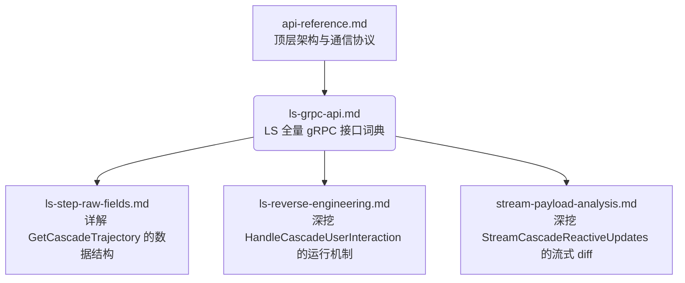

# 文档关系分析

通过阅读 `/docs/` 目录下的 5 个 markdown 文件，它们之间呈现出一种从**宏观架构设计**到**底层 API 参考**，再到**具体特性探究**的层级树状关系。

以下是它们的第一层核心关系分析：

### 1. `api-reference.md` (顶层架构与集成指南)
**地位**：最高层的集成文档。
**关系**：它是整个系统（前端、BFF Server、Language Server）之间如何交互的宏观视角，涵盖了架构图、WebSocket v2 协议规范以及模型配置等。它将底层的 gRPC API 封装成了高层概念。可以理解为**树的根节点**。

### 2. `ls-grpc-api.md` (核心 API 字典)
**地位**：全面的全量接口目录。
**关系**：它是 `api-reference.md` 中 gRPC 部分的详细展开。作为**核心主干**，它罗列了 LS 进程开放的所有端点（如对话管理、MCP、拦截器等）。后续的三个文档都是对这个目录中特定 API 功能的**深度解析或逆向复盘**。

### 3. 具体特性深挖文档 (叶子节点)
这三个文档都是针对 `ls-grpc-api.md` 中特定 API 数据结构或行为的深度探究：

*   **`ls-step-raw-fields.md` (数据与映射规范)**
    **关系**：它是对 gRPC API 中 `GetCascadeTrajectory` 接口返回数据的补充说明。解答了“当调用获取轨迹 API 时，里面具体包含哪些神器的字段（如 `codeAction` 等），以及前端 Normalizer 是如何映射它们的”。
*   **`ls-reverse-engineering.md` (交互逆向复盘)**
    **关系**：它是对 gRPC API 中 `HandleCascadeUserInteraction` 接口的深度逆向报告。阐述了如何通过探测手段找到了审批命令、审批代码修改等交互机制的工作原理及 protobuf 结构。
*   **`stream-payload-analysis.md` (流式响应解析)**
    **关系**：它是对 gRPC API 中 `StreamCascadeReactiveUpdates` 接口的深度分析。解答了为什么流式 API 推送的是 protobuf diff 而不是纯文本增量，并解释了系统为什么采用目前的轮询/拉取混合架构来实现文字流式输出。

---
### 总结架构图

